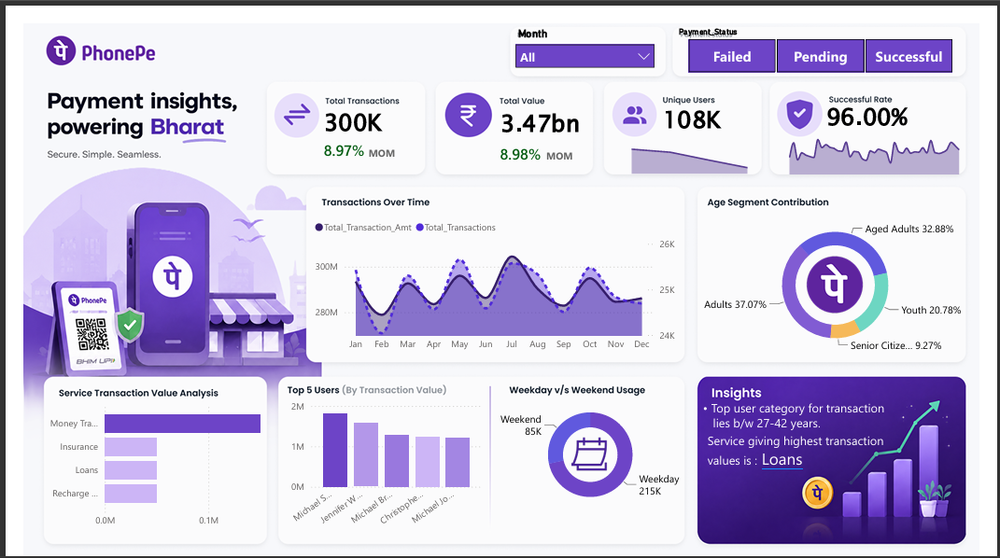

# 📊 PhonePe Transaction Insights Dashboard

)

## 📌 Project Overview

The **PhonePe Transaction Insights Dashboard** is an interactive Power BI dashboard designed to analyze digital payment transactions and provide actionable business insights. It enables stakeholders to monitor transaction performance, user behavior, payment success rates, and demographic trends through intuitive visualizations and KPIs.

The dashboard helps identify high-performing transaction categories, analyze user engagement, monitor transaction status, and understand customer demographics for better business decision-making.

---

# 🎯 Business Problem

As digital payment platforms process millions of transactions daily, businesses require a centralized dashboard to monitor key performance indicators and identify trends.

This dashboard answers questions such as:

- What is the total transaction volume and value?
- What percentage of transactions are successful?
- Which age group contributes the most transactions?
- Which service category generates the highest transaction value?
- How do transactions change over time?
- Which users contribute the highest transaction value?
- How does weekday usage compare with weekend usage?

---

# 📂 Dataset

The dashboard was built using a PhonePe transaction dataset containing information about:

- Transaction Amount
- Transaction Status
- Payment Date
- Service Category
- User Details
- Age
- Payment Method
- Transaction Value
- Month

---

# 🛠 Tools & Technologies

- **Power BI Desktop**
- **Power Query**
- **DAX**
- **Data Modeling**
- **Excel / CSV**

---

# 📊 Dashboard Features

### KPI Cards

- ✅ Total Transactions
- ✅ Total Transaction Value
- ✅ Unique Users
- ✅ Successful Transaction Rate

---

### Interactive Filters

- Month
- Payment Status

---

### Visualizations

- Transaction Trend Analysis
- Transaction Value Trend
- Age Segment Contribution
- Service Transaction Value Analysis
- Top 5 Users by Transaction Value
- Weekday vs Weekend Transaction Usage
- Business Insight Panel

---

# 📈 Key Insights

### 💳 Transaction Performance

- Total transactions reached **300K**.
- Overall transaction value exceeded **₹3.47 Billion**.
- Transaction growth increased by approximately **9% Month-over-Month**.

---

### ✅ Success Rate

- **96%** of all transactions were completed successfully.
- Dashboard allows filtering by **Successful**, **Pending**, and **Failed** transactions.

---

### 👥 Customer Demographics

Age-wise transaction contribution:

| Age Group | Contribution |
|-----------|-------------:|
| Adults | 37.07% |
| Aged Adults | 32.88% |
| Youth | 20.78% |
| Senior Citizens | 9.27% |

Adults represent the largest share of transaction activity.

---

### 💰 Service Analysis

The highest transaction value comes from:

- Loans
- Insurance
- Money Transfer
- Recharge

Loans generate the highest overall transaction value.

---

### 📅 Transaction Trends

Monthly transaction analysis reveals consistent transaction activity throughout the year with seasonal fluctuations, enabling businesses to identify periods of high engagement.

---

### 👤 User Analysis

The dashboard highlights the **Top 5 Users** based on transaction value, helping identify high-value customers.

---

### 📆 Usage Pattern

Weekday transactions significantly exceed weekend transactions.

- Weekday Usage: **215K**
- Weekend Usage: **85K**

---

# 📸 Dashboard Preview

## Main Dashboard



---

# 📋 Business Value

This dashboard helps businesses:

- Monitor transaction performance
- Improve payment success rates
- Understand customer demographics
- Identify high-value services
- Track monthly growth
- Analyze user engagement
- Support data-driven decision making

---

# 📐 Data Preparation

The dataset was transformed using **Power Query** by:

- Removing duplicate records
- Handling missing values
- Standardizing column names
- Creating age groups
- Formatting date fields
- Creating calculated columns
- Building relationships between tables

---

# 📊 DAX Measures Used

Examples of measures created:

- Total Transactions
- Total Transaction Value
- Successful Transactions
- Successful Rate
- Unique Users
- Month-over-Month Growth
- Transaction Percentage

---

# 🚀 How to Use

1. Clone this repository.

```bash
git clone https://github.com/yourusername/phonepe-transaction-dashboard.git
```

2. Open **PhonePe Dashboard.pbix** in **Power BI Desktop**.

3. Refresh the dataset if required.

4. Interact with the dashboard using the slicers.

---

# 📁 Repository Structure

```
PhonePe-Transaction-Dashboard/
│
├── Dashboard/
│   └── PhonePe Dashboard.pbix
│
├── Dataset/
│   └── phonepe_transactions.csv
│
├── assets/
│   └── dashboard.png
    └── logos
    └── colors hex-codes
│
├── README.md
│
└── LICENSE
```

---

# 🎯 Skills Demonstrated

- Power BI Dashboard Design
- Data Visualization
- DAX
- Power Query
- Data Cleaning
- Data Modeling
- Business Intelligence
- KPI Design
- Analytical Thinking

---

# 🔮 Future Enhancements

- Regional transaction analysis using maps
- Merchant-level insights
- Payment method analysis
- Fraud detection dashboard
- Forecasting future transaction trends
- Drill-through reports
- Mobile responsive layout

---

## ⭐ If you found this project helpful, consider giving it a star!
